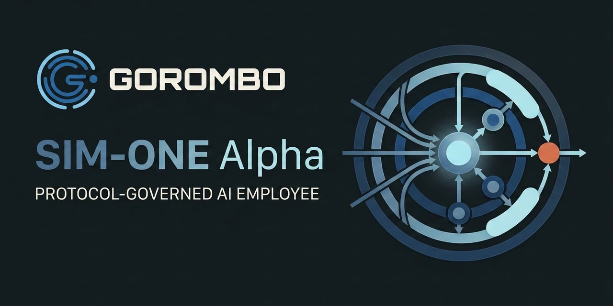

# SIM-ONE Alpha

[](CHANGELOG.md)
[](https://github.com/dansasser/sim-one-alpha/actions/workflows/ci.yml)
[](https://gorombo.com)


[](https://flueframework.com/)
[](https://simoneframework.org)
[](https://deepwiki.com/dansasser/sim-one-alpha)
[](LICENSE)



SIM-ONE Alpha is a protocol-governed AI employee from [Gorombo](https://gorombo.com), built with [Flue](https://flueframework.com/) and the [SIM-ONE Framework](https://simoneframework.org). It is the base architecture behind Gorombo's AI Employees: a self-hosted runtime that combines protocols, memory, RAG, workers, tools, schedules, connectors, approvals, and local computer control so AI employees can receive work, learn as they work, and act through governed execution paths.

> **Pre-release notice:** SIM-ONE Alpha `0.1.0 Beta` has not been published.
> The release package and `sim-one.sh` installer are not available yet. The
> repository can be built from source, while packaged onboarding, service
> commands, the Web UI, Discord, and full release protocol enforcement remain
> release gates. See [Pre-Release Status](docs/getting-started/pre-release-status.md).

## Table of Contents

- [Status](#status)
- [What Is SIM-ONE Alpha?](#what-is-sim-one-alpha)
- [SIM-ONE Alpha vs OpenClaw and Hermes Agent](#sim-one-alpha-vs-openclaw-and-hermes-agent)
- [Why Governance Matters](#why-governance-matters)
- [Features](#features)
- [Quick Start](#quick-start)
- [Installation](#installation)
- [Configuration](#configuration)
- [Usage](#usage)
- [Architecture](#architecture)
- [Extensibility](#extensibility)
- [Documentation](#documentation)
- [Development](#development)
- [Contributing](#contributing)
- [Author](#author)
- [Code of Conduct](#code-of-conduct)
- [Security](#security)
- [Support](#support)
- [Changelog](#changelog)
- [License](#license)
- [Gorombo And The SIM-ONE Framework](#gorombo-and-the-sim-one-framework)

## Status

SIM-ONE Alpha is the base architecture behind [Gorombo](https://gorombo.com)'s AI Employees. The pre-release source provides the `sim-one` CLI, SIM-ONE terminal UI, gateway API, Telegram connector, scheduled jobs, runtime capability management, memory/RAG, worker delegation, protocol loading, and approval-gated Git and GitHub actions. Packaging and the remaining release gates are tracked in [Pre-Release Status](docs/getting-started/pre-release-status.md).

## What Is SIM-ONE Alpha?

SIM-ONE Alpha is an AI employee system: an agent runtime that can receive work, load operating rules, remember context, retrieve knowledge, delegate specialized tasks, use tools, and report back through connected interfaces.

It is built to be an AI employee you can trust because control does not live in one long assistant prompt. Every request enters through an orchestrator; protocols define the applicable rules; memory and RAG provide grounded context; registries define available skills, tools, workers, and MCP servers; workers handle specialized execution; tools expose bounded actions; and approvals gate risky changes.

The model still reasons, but the runtime governs how work is admitted, routed, executed, validated, and remembered. As work history, documents, preferences, and capabilities grow, SIM-ONE Alpha learns as it works without moving authority out of the governed execution layer.

## SIM-ONE Alpha vs OpenClaw and Hermes Agent

SIM-ONE Alpha belongs in the same broader category as [OpenClaw](https://github.com/openclaw/openclaw) and [Hermes Agent](https://github.com/NousResearch/Hermes-Agent): self-hosted AI agents that can use tools, remember context, connect to external channels, automate work, and improve over time.

The difference is architectural. SIM-ONE Alpha uses [Flue](https://flueframework.com/) as the agent harness and layers the [SIM-ONE Framework](https://simoneframework.org) on top of it so governance is not just prompt text. The orchestrator is the control plane for action and flow: it owns protocol loading, capability selection, worker delegation, validation, and policy rejection. The Protocol Tool, trusted-event lookup, SQLite provider, and base protocol records are present in the source; the complete release policy set and fail-closed pre-execution activation remain release gates.

| Area | OpenClaw | Hermes Agent | SIM-ONE Alpha |
| --- | --- | --- | --- |
| Product class | Local-first personal AI assistant and agent gateway | Self-improving assistant and automation agent | Protocol-governed AI employee runtime |
| Primary promise | A personal assistant that can connect across messaging surfaces and local automation | An agent that grows through tools, skills, memory, MCP, schedules, and gateway control | AI employees that receive work, remember context, delegate execution, and act through governed runtime paths |
| Interfaces | Messaging gateway, local app/runtime, and assistant surfaces | CLI, messaging gateway, scheduled execution, and agent runtime surfaces | `sim-one` CLI, SIM-ONE terminal UI, gateway API, Telegram, and scheduled jobs in the pre-release source |
| Security architecture | Controls sit around the assistant session, gateway, and tool execution path | Controls sit around the agent loop, tools, skills, MCP, schedules, approvals, and subagents | The orchestrator is the required control layer: the protocol path and governed registries exist now; complete release policy records and fail-closed pre-execution enforcement are release gates |
| Authority model | The assistant session is the primary control surface for reasoning, tool use, and user interaction | The agent control loop coordinates tools, skills, memory, schedules, approvals, and subagents | The orchestrator is the mandatory control plane between users, protocols, memory, tools, workers, approvals, and final response |
| Governance source | Assistant instructions, settings, tool policies, workflow behavior, and gateway configuration | Assistant instructions, skills, tools, approval flows, gateway configuration, and runtime settings | SQLite-backed protocol records loaded through the Protocol Tool from trusted event context; release policy coverage and mandatory runtime enforcement are completed before publication |
| Task execution | The assistant can use available tools and automation paths directly within its session model | The agent uses tools, skills, schedules, MCP, and subagents to complete work | Workers execute specialized work; the orchestrator governs routing, policy, validation, and final response |
| Workers / subagents | Subagents and assistant workflows extend the main assistant experience | Subagents support task specialization inside the agent system | Workers are first-class executors that report back to the orchestrator instead of owning final authority |
| Memory and learning | Assistant memory and context support continuity and personalization | Persistent memory, skills, and workflows support agent growth over time | Memory, RAG, work history, and capability records are retrieved and applied through the governed runtime |
| Skills / tools / MCP | Tools and assistant capabilities enable local and connected automation | 40+ tools, skills, MCP, and automation capabilities | Dual-layer capability model: Flue-native built-ins plus SIM-ONE runtime registry for skills, tools, workers, and MCP servers without rebuilding |
| Workflows and schedules | Agent workflows and messaging automation support repeated tasks | Cron scheduling and reusable skills/workflows support recurring automation | Schedules trigger durable orchestrator turns; trusted context handoff and result delivery remain release gates |
| Approvals and mutations | Tool and host access depend on the configured context and execution mode | Command approval and container isolation control risky execution paths | Risky side effects move through approval-gated mutation paths; workers do not silently mutate global state |
| Best fit | Personal AI assistant and multi-channel local automation | Self-improving automation agent for users who want broad tool reach | AI employee platform where governance, auditability, and enforced operating rules matter |

## Why Governance Matters

Most agents can be given rules. The hard part is making sure those rules remain in force when the agent starts using tools, delegating work, writing files, scheduling tasks, or acting on a local machine.

SIM-ONE Alpha handles that by putting the orchestrator in the middle of every action. Users do not talk directly to workers. Workers do not silently own final authority. Tools are not available merely because the model saw them in a prompt. Every normal request moves through a more linear, auditable path:

```text
User or connector
-> Gateway
-> Orchestrator
-> Runtime protocols
-> Registries / memory / workers / tools
-> Approval gates when needed
-> Validation
-> Response
```

The orchestrator governs. Workers execute.

Protocols are runtime rule records stored in SQLite, not just instructions inside the model context. The Protocol Tool is attached to the orchestrator, rehydrates trusted event context, and loads matching enabled records. Chat ingress and orchestrator instructions require that call before final reasoning, tool execution, worker delegation, or response generation. Capabilities are exposed through registries, workers report back to the orchestrator, and approval paths gate risky mutations. Activation of the complete release protocol set and fail-closed pre-execution enforcement is recorded in [Pre-Release Status](docs/getting-started/pre-release-status.md).

That is the SIM-ONE Alpha difference: security and governance are part of the runtime architecture, not only a set of reminders inside an assistant prompt.

## Features

### Governed Runtime

- Protocol Tool attached to the orchestrator with trusted-event lookup and SQLite-backed rule loading.
- Base protocol records for global, delegation, chat, coding verification, approval, and progress behavior.
- Gateway-centered ingress for connector messages, API requests, schedules, approvals, telemetry, and durable sessions.
- Approval-gated mutation paths for risky local, coding, MCP, and external side effects.

### Memory, RAG, And Research

- Rust/WASM structured memory helper for durable checklists, todos, session notes, and task continuity.
- Session memory, project context, user preferences, task history, and document records through the memory/RAG layer.
- Web research through the researcher worker with query planning, fetch budgets, source packing, cache support, confidence, and provider-failure reporting.
- Local and cloud embedding support with LanceDB-backed vector retrieval.

### Workers And Execution

- First-class researcher worker for current, external, source-backed, and web research tasks.
- First-class coding worker with triage, implementation, test/debug, code review, and GitHub workflow support.
- Worker-local subagents that report back to the orchestrator instead of owning final authority.
- Live Flue operation, tool, validation, and approval rows in the terminal
  interface. Dedicated Coding Worker checkpoint forwarding to active
  connectors remains a release gate.

### Capabilities And Extensibility

- Dual-layer capability model: Flue-native built-ins plus SIM-ONE runtime registry.
- Runtime-managed skills, tools, workers, and MCP servers through SQLite-backed capability records.
- `sim-one` capability subcommands for skills, tools, workers, and MCP servers.
- Collision detection and enablement rules for built-in and user-added capabilities.

### Interfaces And Operations

- Product `sim-one` CLI for launching the local experience and managing capabilities.
- SIM-ONE terminal UI with separate transcript/context pane, editable prompt pane, status bar, live progress rows, and durable session controls.
- TUI slash commands for `/session`, `/sessions`, `/new`, `/clear`, `/resume`, `/rename`, `/compact`, `/help`, and `/exit`.
- Gateway API, Telegram connector, scheduled jobs, and app-owned HTTP routes for chat events, sessions, knowledge, approvals, telemetry, and schedules.

### Models, Tools, And Local Actions

- Model-card system for provider selection, context budgets, output budgets, and compaction behavior.
- Built-in tools for protocols, memory, knowledge, schedules, image generation, and governed capability management.
- Local computer control through governed tools, workers, approvals, and runtime protocols.

## Quick Start

The `0.1.0 Beta` release package and `sim-one.sh` are not published yet. For
pre-release evaluation, follow [Build From Source](#build-from-source), then
launch the locally built `sim-one` command. The packaged first-run experience,
including credential collection, onboarding, first chat, and conversational
connector pairing, is documented in
[Pre-Release Status](docs/getting-started/pre-release-status.md) until the
versioned, checksum-verified release assets are available.

## Installation

### Install With `sim-one.sh`

The packaged installer is the release installation method, but it is not
published during this pre-release. Publication requires a versioned release
archive, `sim-one.sh`, checksums, and an integrity-verified download procedure.
It installs the runtime, terminal interface, `sim-one` command,
structured-memory engine, and local assets under `~/.gorombo/`, then continues
through onboarding to the first working conversation. See
[Installation](docs/getting-started/installation.md) for the release contract
and the currently available source-build path.

### Build From Source

Building from source produces the same runtime, terminal interface, and `sim-one` product command as the packaged installer.

Prerequisites:

- Git
- Node.js 22.18 or newer
- npm (included with Node.js) or pnpm 10
- Rust stable with the `wasm32-unknown-unknown` target
- `wasm-pack` 0.13.1

Clone the repository:

```bash
git clone https://github.com/dansasser/sim-one-alpha.git
cd sim-one-alpha
```

Choose either npm or pnpm for the build.

#### npm

```bash
npm install
npm --prefix sim-one-cli install
npm run fetch-embedding-model
npm run build
npm run build:tui
npm --prefix sim-one-cli run build
```

#### pnpm

```bash
pnpm install
pnpm fetch-embedding-model
pnpm run build
pnpm run build:tui
pnpm run build:cli
```

Start SIM-ONE with:

```bash
./.gorombo/sim-one-cli/sim-one
```

Both source-build paths fetch the bundled embedding model, compile the Rust/WASM structured-memory engine, build the Flue Node runtime, build the terminal interface, and create the `sim-one` product wrapper. Source builds currently use file-based configuration; the packaged onboarding command is a release gate.

## Configuration

SIM-ONE Alpha keeps runtime behavior separate from secrets. The pre-release
source build uses these checkout-local files:

| File | Purpose |
| --- | --- |
| `src/core/config/gorombo.config.json` | Source configuration seed copied by the runtime build |
| `.gorombo/sim-one-alpha/gorombo.config.json` | Generated configuration loaded by the locally built server |
| `.env` | Provider API keys, connector tokens, service credentials, and operational overrides |

Edit the source seed before building; rebuilding replaces the generated copy.
The packaged onboarding flow will own the installed files under
`~/.gorombo/`. Keep secrets in `.env` or your deployment secret manager. Do
not commit `.env` or place credentials in `gorombo.config.json`.

### Select Models

`models.primary` selects the active project model card. `models.backup` is optional and must select a different card.

```json
{
  "version": 1,
  "models": {
    "primary": "minimax-m3-cloud",
    "backup": "codex-brain"
  },
  "gateway": {
    "port": 3940
  }
}
```

Available agentic-chat card keys:

| Model card | Provider credentials |
| --- | --- |
| `minimax-m3-cloud` | `OLLAMA_API_KEY` or `OLLAMA_CLOUD_API_KEY` |
| `deepseek-v4-pro-cloud` | `OLLAMA_API_KEY` or `OLLAMA_CLOUD_API_KEY` |
| `qwen3-5-cloud` | `OLLAMA_API_KEY` or `OLLAMA_CLOUD_API_KEY` |
| `kimi-k2.7-code-cloud` | `OLLAMA_API_KEY` or `OLLAMA_CLOUD_API_KEY` |
| `codex-brain` | `CODEX_BRAIN_LOCAL_API_URL` and `CODEX_BRAIN_LOCAL_API_KEY` |

Ollama Cloud uses `https://ollama.com/v1` unless `OLLAMA_CLOUD_BASE_URL` is set. A Codex Brain URL must include the OpenAI-compatible `/v1` base path.

The runtime validates credentials for both selected cards at startup. The shipped primary and backup therefore require an Ollama Cloud key plus both Codex Brain values. Remove `models.backup` or select another configured backup when only one provider is available.

Model selection belongs in the source seed and its generated runtime copy. Raw provider/model specifiers and the legacy `GOROMBO_MODEL`, `GOROMBO_MODEL_BACKUP`, and `GOROMBO_CONFIG_PATH` environment variables are not supported.

### Configure Services

Add only the integrations you enable:

| Service | Configuration |
| --- | --- |
| External gateway clients | Set `API_SECRET`; loopback TUI requests do not require it |
| Telegram | Set `TELEGRAM_BOT_TOKEN` and `TELEGRAM_WEBHOOK_SECRET_TOKEN`; approved/admin user IDs and group mention settings are optional |
| Web research | Uses Ollama Search and the configured Ollama key by default; `OLLAMA_WEB_SEARCH_BASE_URL` and `OLLAMA_WEB_SEARCH_TIMEOUT_MS` are optional |
| Runpod image generation | Set `RUNPOD_API_KEY`; endpoint, model-catalog, and output-directory overrides are optional |

Telegram remains disabled when `TELEGRAM_BOT_TOKEN` is omitted. Telegram access
is paired and governed through trusted connector and local administration
surfaces.

### Runtime Data

The pre-release source build uses both checkout-relative and user-level
durable state:

| Data | Default location |
| --- | --- |
| Flue persistence and sessions | `.gorombo/db/flue.sqlite`, `.gorombo/db/sessions.sqlite` |
| Protocols, structured memory, and schedules | `.gorombo/db/` |
| Vector retrieval data | `.gorombo/vector/` |
| Capability registry and installed definitions | `~/.gorombo/db/capabilities.sqlite`, `~/.gorombo/capabilities/` |
| Approval records and managed GitHub authentication | `~/.gorombo/approvals/`, `~/.gorombo/auth/github/` |

Relative paths resolve from the checkout working directory. The packaged
release will place installed runtime data under `~/.gorombo/`. Storage paths
can be changed in the `storage`, `memory`, and `schedules` blocks or through
their documented `GOROMBO_*` deployment overrides. These locations contain
runtime-managed state; back them up as needed, but do not edit the SQLite
databases directly.

### Apply Changes

Configuration is loaded when the gateway starts. After changing a file or
secret, restart the gateway through the process or service manager that launched
it, then open `sim-one` and verify an end-to-end response. The packaged
`restart` and `doctor` commands are not available in the pre-release CLI.

Startup fails closed for invalid JSON, unsupported configuration versions, invalid gateway values, unknown model-card keys, duplicate primary/backup selection, or missing credentials for a selected model.

## Usage

The current `sim-one` command launches the terminal interface and manages
runtime capabilities. Commands entered in the shell are separate from slash
commands entered inside the TUI.

### Product Commands

| Command | Purpose |
| --- | --- |
| `sim-one` | Open the terminal interface. |
| `sim-one skill ...` | Manage runtime skills. |
| `sim-one tool ...` | Manage runtime tools. |
| `sim-one worker ...` | Manage runtime workers. |
| `sim-one mcp ...` | Manage runtime MCP servers. |
| `sim-one --help` | Show the complete CLI command reference. |

### Launch The Terminal Interface

Run `sim-one` without a subcommand to open the TUI in a fresh durable session. The client connects to the configured gateway or starts the local gateway when needed.

```bash
sim-one
```

| Command | Purpose |
| --- | --- |
| `sim-one --session <selector>` | Resume an owned session by exact id or explicit name. |
| `sim-one --port <number>` | Use a local gateway port from 1 to 65535. |
| `sim-one --base-url <url>` | Connect to an existing loopback HTTP gateway or local SSH tunnel; overrides `--port`. |
| `sim-one -h` or `sim-one --help` | Show CLI help. |

Examples:

```bash
sim-one --session "Release testing"
sim-one --port 3000
sim-one --base-url http://127.0.0.1:3000
```

### Extend SIM-ONE

Use the `sim-one skill`, `sim-one tool`, `sim-one worker`, and `sim-one mcp` command families to manage runtime capabilities. See [Extensibility](#extensibility) for the capability model, trust and approval rules, lifecycle, and complete command reference.

### Use TUI Slash Commands

Type `/` at the beginning of the TUI prompt to open the command palette. Use `Up` and `Down` to select a command, then `Enter` or `Tab` to insert it.

| Command | Purpose |
| --- | --- |
| `/new [title]` | Create a new durable session and switch to it. |
| `/clear [title]` | Replace the active conversation with a new durable session while preserving the previous session for resume. |
| `/resume <session-id-or-name>` | Resume an owned session by exact id or explicit name. |
| `/sessions [limit]` | List recent owned sessions; the default is 10 and the accepted range is 1 to 50. |
| `/session` | Show the active session id. |
| `/rename <title>` | Rename the active session. |
| `/compact` | Compact the active durable session without sending the command to the model. |
| `/help` | Show the in-TUI command reference. |
| `/exit` | Exit cleanly and print the active session id for later resume. |

Slash commands are parsed as application controls before prompt text reaches the model. Use the id printed by `/exit` with `sim-one --session <selector>` to resume that session later.

## Architecture

SIM-ONE Alpha combines [Flue](https://flueframework.com/) runtime primitives with [SIM-ONE Framework](https://simoneframework.org) governance. Flue supplies the durable agent harness; SIM-ONE defines how that harness admits, routes, executes, evaluates, and remembers work. SIM-ONE Alpha is the product implementation of those two layers.

### Flue Runtime Foundation

Flue is the TypeScript foundation for durable agents and sessions, workflows, skills, tools, workers/subagents, MCP connections, persistence, compaction, sandboxing, routing, and observability. The SIM-ONE gateway mounts the Flue runtime, and each conversation enters a durable orchestrator session. Flue remains the execution foundation while product governance and business data remain owned by SIM-ONE Alpha.

### SIM-ONE Governance Layer

SIM-ONE Alpha applies the SIM-ONE Framework through a governing orchestrator
that owns routing, protocol access, capability selection, delegation, and final
response synthesis. The source includes the Protocol Tool, trusted-event
rehydration, SQLite protocol provider, base protocol records, worker boundaries,
and approval services.

The `0.1.0 Beta` release activates the complete policy set and fail-closed
pre-execution enforcement needed for the orchestrator/critic to score and reject
every disallowed path. That activation is a release gate, not a claim about the
current source checkout. Protocols define mandatory rules; memory and RAG
provide context. Skills, tools, workers, and MCP servers do not override either
the active protocol bundle or product-owned runtime checks.

### Governed Execution Flow

```text
TUI / Telegram / API / schedule
-> Secure gateway and normalized event
-> Durable Flue orchestrator session
-> Protocol Tool and SQLite protocol bundle
-> Orchestrator routing and validation
-> Memory, RAG, and capability registries
-> Governed tool, worker, workflow, or MCP execution
-> Structured result returned to the orchestrator
-> Protocol and response validation
-> Approval, revision, rejection, or final response
```

Workers are controlled executors, not independent authorities. They perform specialized work in child sessions, report structured results to the orchestrator, and remain inside the same protocol, validation, and approval path.

### Built-In And Runtime Capabilities

SIM-ONE Alpha exposes capabilities through two layers:

| Layer | What it contains | How it enters the runtime |
| --- | --- | --- |
| Flue / built-in | Product-shipped skills, tools, worker profiles, and MCP servers | Defined with the application and attached through Flue |
| SIM-ONE runtime registry | User- or agent-added skills, tools, workers, and MCP servers | Stored in SQLite; file-backed capabilities are materialized under `~/.gorombo/capabilities/` and enabled capabilities load after restart without rebuilding |

Enabled runtime tools and MCP tools join the built-in Flue tool surface, worker profiles join the available subagents, and skills join Flue skill discovery. Registration does not grant unrestricted authority: enablement, identity and scope, collision checks, protocols, and approval requirements still apply.

### Persistence And State

Flue SQLite stores canonical agent-runtime state such as durable sessions, accepted submissions, agent and workflow runs, and event streams. SIM-ONE application stores hold product and governance state such as logical session and connector metadata, protocols, structured memory, schedules, capability records, retrieval data, and approvals. Structured checklists, todos, and session notes are managed by the Rust/WebAssembly memory helper and persisted to SQLite.

Keeping those layers distinct lets Flue resume and observe execution while SIM-ONE controls the rules, context, capabilities, and durable business state applied to that execution.

Detailed references:

- [Architecture index](docs/architecture/README.md)
- [Flue architecture contract](docs/architecture/flue-architecture.md)
- [SIM-ONE Alpha Flue map](docs/architecture/gorombo-flue-map.md)
- [Orchestrator flow](docs/architecture/orchestrator-flow.md)
- [Protocol system](docs/architecture/protocol-system.md)
- [Tool system](docs/architecture/tool-system.md)
- [Skill system](docs/architecture/skill-system.md)
- [Worker system](docs/architecture/worker-system.md)
- [Retrieval and research](docs/architecture/retrieval-and-research.md)
- [Execution workflows](docs/architecture/execution-workflows.md)
- [Capability system](docs/architecture/capability-system.md)
- [Registry system](docs/architecture/registry-system.md)
- [Memory system](docs/architecture/memory-system.md)
- [Model system](docs/architecture/model-system.md)
- [Schedules system](docs/architecture/schedules-system.md)

## Extensibility

SIM-ONE Alpha supports the built-in and runtime capability layers described in [Architecture](#built-in-and-runtime-capabilities). Built-in capabilities ship with the product. Runtime capabilities can be added by users or agents without changing or rebuilding the product artifact, then enter the same governed Flue surfaces as built-ins.

### Capability Types

| Type | Purpose | Default when added |
| --- | --- | --- |
| Skill | Reusable instructions, procedures, and supporting resources loaded through Flue skill discovery | Enabled |
| Tool | Typed executable action exposed to an owning agent | Disabled unless `--enable` is supplied |
| Worker | Specialized executor loaded as a Flue subagent profile | Disabled unless `--enable` is supplied |
| MCP server | HTTP or HTTPS connection that contributes remote tools | Disabled unless `--enable` is supplied |

Protocols are not skills or capabilities. They are SQLite-backed runtime rules
loaded separately through the Protocol Tool and cannot be overridden by an
installed capability. The complete release policy set and fail-closed
pre-execution activation are identified in
[Pre-Release Status](docs/getting-started/pre-release-status.md).

### Runtime Capability Lifecycle

The SQLite registry at `~/.gorombo/db/capabilities.sqlite` is authoritative. Each record tracks its kind, id, name, description, source, source reference, version, enabled state, configuration, timestamps, and whether it was installed by the CLI, an agent, or product configuration.

```text
User or agent requests a capability
-> Validate id, source, and built-in/runtime collisions
-> Write the capability record to SQLite
-> Materialize file-backed skill, tool, or worker files
-> Enable immediately or wait for approval
-> Restart the gateway
-> Load enabled records during orchestrator initialization
-> Merge skills, tools, workers, and MCP tools into Flue
```

File-backed skills, tools, and workers are materialized under `~/.gorombo/capabilities/`. MCP server URLs, transports, and token environment-variable names remain in SQLite; authentication tokens remain in the environment. Capabilities survive product upgrades because their records and managed files live outside the built artifact.

Skill, tool, and worker sources can be Git repository URLs or local directories. Capability ids must be safe slugs rather than filesystem paths, and ids cannot collide with built-in or existing runtime capabilities. The pre-release CLI accepts and records `--version`, but file materialization shallow-clones the remote default branch; reliable branch, tag, and commit pinning remains a release gate. Local directory sources ignore the recorded version. Updating re-fetches file-backed sources, while removal deletes the registry record and any managed files. A gateway restart reloads capability changes without rebuilding SIM-ONE Alpha.

### Trust And Governance

CLI changes are explicit user actions. Agent-added skills can be enabled immediately because skills contain instructions rather than executable code. Agent-added tools, workers, and MCP servers remain disabled until the user approves them.

Registration and enablement do not grant unrestricted authority. Current source
constrains loaded capabilities through trusted identity and scope, typed tool
boundaries, worker ownership, and approval-gated Git and GitHub mutation paths.
Complete protocol scoring and orchestrator/critic enforcement across every
capability path remain release gates.

### Manage Skills

Add skills from a Git repository URL or local directory. Skills are enabled when added.

```bash
sim-one skill add <source> <id> "<name>" \
  [--description "<text>"] [--version <requested-version>] [--enable]
sim-one skill list
sim-one skill enable <id>
sim-one skill disable <id>
sim-one skill update <id>
sim-one skill remove <id>
sim-one skill --help
```

`skill update` re-fetches the recorded source. `skill remove` deletes the registry record and its managed skill files.

### Manage Tools

Add tools from a Git repository URL or local directory. Tools are disabled when added unless `--enable` is supplied.

```bash
sim-one tool add <source> <id> "<name>" \
  [--description "<text>"] [--version <requested-version>] [--enable]
sim-one tool list
sim-one tool enable <id>
sim-one tool disable <id>
sim-one tool update <id>
sim-one tool remove <id>
sim-one tool --help
```

`tool update` re-fetches the recorded source. `tool remove` deletes the registry record and its managed tool files.

### Manage Workers

Add specialized workers from a Git repository URL or local directory. Workers are disabled when added unless `--enable` is supplied.

```bash
sim-one worker add <source> <id> "<name>" \
  [--description "<text>"] [--version <requested-version>] [--enable]
sim-one worker list
sim-one worker enable <id>
sim-one worker disable <id>
sim-one worker update <id>
sim-one worker remove <id>
sim-one worker --help
```

`worker update` re-fetches the recorded source. `worker remove` deletes the registry record and its managed worker files.

### Manage MCP Servers

Register an HTTP or HTTPS MCP endpoint. MCP servers are disabled when added unless `--enable` is supplied.

```bash
sim-one mcp add <id> "<name>" --url <url> \
  [--transport <streamable-http|sse>] [--token-env <ENV_NAME>] \
  [--description "<text>"] [--enable]
sim-one mcp list
sim-one mcp enable <id>
sim-one mcp disable <id>
sim-one mcp update <id>
sim-one mcp remove <id>
sim-one mcp --help
```

`--url` is required. The default transport is `streamable-http`; `sse` is also supported. `--token-env` records the name of an environment variable containing the authentication token, not the token itself; names must start with a letter or underscore and contain only letters, numbers, and underscores. In the pre-release CLI, `mcp update` changes only the record's update timestamp. To change the URL, transport, token environment-variable name, name, or description, remove and re-add the MCP server. Removing an MCP server deletes its connection record.

After adding, enabling, disabling, updating, or removing a capability, restart
the gateway through the process or service manager that launched it. This
reloads the runtime capability registry. A product rebuild is not required.

See the [Capability system](docs/architecture/capability-system.md) and [Registry system](docs/architecture/registry-system.md) for implementation details.

## Documentation

The complete documentation set is organized in the [documentation hub](docs/README.md).

Explore [SIM-ONE Alpha on DeepWiki](https://deepwiki.com/dansasser/sim-one-alpha)
for generated, source-linked architecture explanations and diagrams, or use
Ask Devin there to ask repository-grounded questions. The versioned
documentation in this repository remains the product and architecture contract.

- [Installation](docs/getting-started/installation.md) and [onboarding](docs/getting-started/onboarding.md)
- [Terminal and session guide](docs/guides/terminal-and-sessions.md)
- [Configuration reference](docs/reference/configuration.md)
- [Connectors and secure pairing](docs/guides/connectors.md)
- [Skills, tools, workers, and MCP extensibility](docs/guides/extending-sim-one.md)
- [CLI reference](docs/reference/cli.md)
- [HTTP API reference](docs/reference/http-api.md)
- [Architecture overview](docs/architecture/overview.md)
- [Operations and troubleshooting](docs/operations/troubleshooting.md)

SIM-ONE Alpha applies the [SIM-ONE Framework](https://simoneframework.org/) on the [Flue](https://flueframework.com/) agent runtime.

## Development

Contributor development begins with the checkout and toolchain described in
[Build From Source](#build-from-source). The repository uses Node.js 22.18 or
newer and supports either npm, included with Node.js, or pnpm 10.10.0.

### Run The Development Runtime

Use the development runtime while changing the Flue application, agents,
workers, tools, skills, connectors, or supporting services.

#### npm

```bash
npm run dev
```

#### pnpm

```bash
pnpm run dev
```

### Build The Complete Product

A complete contributor build prepares the embedding assets and Rust/WebAssembly
memory helper, then builds the Flue runtime, SIM-ONE TUI, CLI, and product
wrapper.

#### npm

```bash
npm run fetch-embedding-model
npm run wasm:build
npm run build
npm run build:tui
npm --prefix sim-one-cli run build
node scripts/check-sim-one-product-command.mjs
```

#### pnpm

```bash
pnpm run fetch-embedding-model
pnpm run wasm:build
pnpm run build
pnpm run build:tui
pnpm run build:cli
node scripts/check-sim-one-product-command.mjs
```

### Verify The Complete Product

Complete verification covers TypeScript and unit tests, Rust crates, the
Rust/WebAssembly memory path, the built Flue HTTP runtime, the packaged SIM-ONE
TUI, and the `sim-one` command. See [CONTRIBUTING.md](CONTRIBUTING.md) for the
full npm and pnpm verification sequences, architecture expectations,
change-specific checks, issue standards, and pull-request requirements.

## Contributing

Use [GitHub Issues](https://github.com/dansasser/sim-one-alpha/issues) for bug
reports, feature requests, and documentation problems. Focused pull requests
that meet the project standards may be submitted against `main`.

Read [CONTRIBUTING.md](CONTRIBUTING.md) before opening an issue or pull request.
Do not disclose vulnerabilities or secrets in public issues; follow the
[Security Policy](SECURITY.md).

## Author

SIM-ONE Alpha was created by
[Daniel T Sasser II](https://dansasser.me), founder and CEO of
[Gorombo](https://gorombo.com) and creator of the
[SIM-ONE Framework](https://simoneframework.org). See
[AUTHORS.md](AUTHORS.md) for authorship, project ownership, and contributor
attribution.

## Code of Conduct

Participation in the SIM-ONE Alpha community is governed by the
[Code of Conduct](CODE_OF_CONDUCT.md). Report conduct concerns privately to
[contact@gorombo.com](mailto:contact@gorombo.com).

## Security

Do not disclose vulnerabilities, credentials, private data, or other sensitive
information in public issues. Report security concerns privately to
[contact@gorombo.com](mailto:contact@gorombo.com) and follow the
[Security Policy](SECURITY.md).

## Support

See [Support](SUPPORT.md) for installation help, usage questions, bug reports,
and feature requests. Security vulnerabilities and conduct concerns must use the
private reporting paths above.

## Changelog

User-visible changes are recorded in the [Changelog](CHANGELOG.md), beginning
with **SIM-ONE Alpha 0.1.0 - Beta Release**.

## License

SIM-ONE Alpha is released under the [MIT License](LICENSE).

## Gorombo And The SIM-ONE Framework

SIM-ONE Alpha is developed by [Gorombo](https://gorombo.com) as the base
architecture behind Gorombo's AI Employees. It applies the
[SIM-ONE Framework](https://simoneframework.org), Gorombo's protocol-governed
method for building AI employees whose rules, context, capabilities, delegated
work, approvals, and responses remain inside an enforced orchestration path.

The product is built with [Flue](https://flueframework.com/), the TypeScript
agent runtime from the Astro ecosystem. Flue provides the durable agent
primitives; the SIM-ONE Framework defines how Gorombo applies those primitives
to governed AI employee systems.
