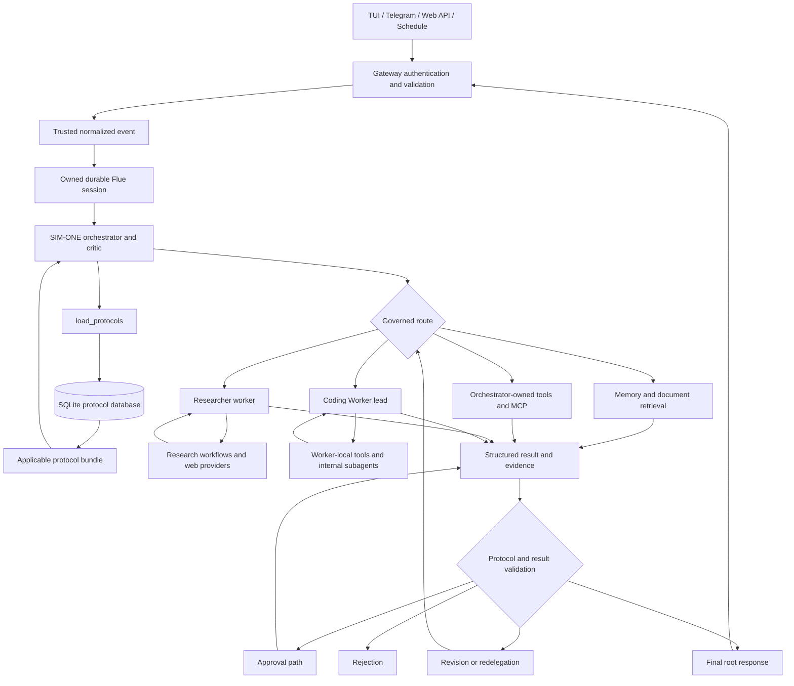

# Orchestrator Flow

This document is the concise execution map for a SIM-ONE Alpha turn. The
[Execution Workflows](execution-workflows.md) reference owns the detailed
conversational, research, coding, schedule, capability, and authentication
flows. The ownership invariants are also enforced by the generated
[development lifecycle graph](../../development-graph.md), especially its
architecture decision and architecture/security review nodes.

## Governed Turn



Equivalent text flow:

```text
connector or schedule
-> authenticated application ingress
-> trusted normalized event
-> owned durable Flue session
-> orchestrator
-> load_protocols from SQLite
-> governed selection of memory, tools, MCP, workflows, or workers
-> structured result returned to the orchestrator
-> protocol and result validation
-> approval, revision, rejection, or final root response
```

## Ownership Rules

- Protocol lookup occurs before final reasoning, execution, delegation, or
  response synthesis.
- The orchestrator owns routing, protocol application, delegation, result
  evaluation, and the final response.
- The researcher owns web, current, external, and source-backed research. The
  orchestrator and Coding Worker do not receive direct web-search tools.
- The Coding Worker lead owns repository execution and its worker-local
  internal subagents.
- Tools execute bounded capabilities; they do not redefine protocols or approve
  their own result.
- Worker output remains internal until the orchestrator evaluates and
  synthesizes it.

## Durable Execution Boundaries

Normal chat uses the app-owned `/api/chat/events` route, which persists trusted
event context and prompts the durable Flue orchestrator agent. Scheduled work
uses Flue `dispatch(...)` and is admitted to the same orchestrator boundary.

Finite workflows remain available for bounded operations. Workflow invocation
creates a Flue run and returns a run pointer; direct agent prompts and
dispatched agent input use the durable agent submission lifecycle instead.

## Source Map

| Responsibility | Source |
| --- | --- |
| Application shell and route mount | `src/app.ts` |
| Chat ingress and trusted event persistence | `src/api/routes/chat-events.ts` |
| Durable session routing | `src/engine/session/` |
| Orchestrator agent | `src/agents/orchestrator.ts` |
| Protocol lookup | `src/engine/tools/protocol-tool.ts` |
| Protocol matching and storage | `src/core/protocols/` |
| Researcher worker | `src/engine/workers/researcher/` |
| Research workflows | `src/workflows/research.ts`, `src/workflows/web-research.ts` |
| Coding Worker | `src/engine/workers/coding-worker/` |
| Schedule dispatch | `src/engine/schedules/schedule-dispatch.ts` |

## Related Documentation

- [Architecture Overview](overview.md)
- [Protocol System](protocol-system.md)
- [Worker System](worker-system.md)
- [Retrieval And Research](retrieval-and-research.md)
- [Execution Workflows](execution-workflows.md)
- [Development Lifecycle Graph](../../development-graph.md)
