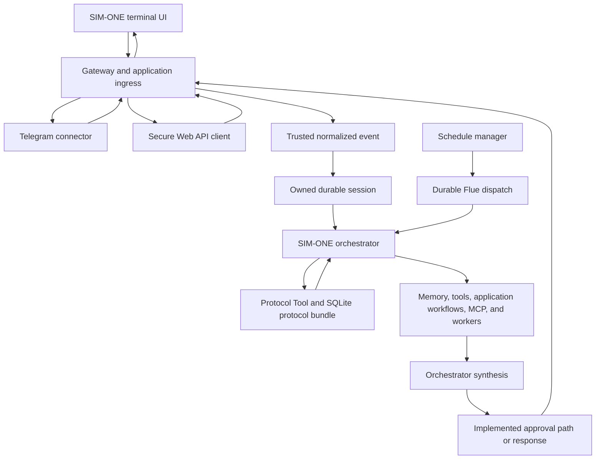

# Product Runtime And Interface Flow

This document describes the SIM-ONE Alpha product surfaces implemented in this
repository and how they enter the runtime. Installation and onboarding
instructions live in the [documentation hub](../README.md); this file owns the
runtime and interface architecture. Complete critic scoring and trusted
fail-closed protocol enforcement remain release gates.

## Product Identity

- **Company:** Gorombo
- **Product:** SIM-ONE Alpha
- **Product command:** `sim-one`
- **Agent runtime framework:** Flue
- **Governance framework:** SIM-ONE Framework
- **Repository:** `sim-one-alpha`

The terminal client, connectors, API routes, schedules, orchestrator, workers,
and capability registries are parts of one SIM-ONE Alpha product. Workers are
internal executors, not separate products or public endpoints.

## Product Surfaces

| Surface | Current responsibility | Runtime boundary |
| --- | --- | --- |
| SIM-ONE terminal UI | Local conversation, durable sessions, transcript replay, progress, and slash commands | Enters the authenticated loopback chat and session APIs as connector `tui` |
| Telegram | Remote messaging, pairing, allow lists, group policy, replies, and approval delivery | Verifies Telegram input, normalizes the event, and dispatches to the orchestrator |
| Secure Web API | External chat, session, knowledge, schedule, approval, telemetry, and connector administration | Applies application-owned authentication and validation before Flue or product services |
| Schedules | Recurring and one-shot agent turns with durable definitions and run history | Dispatches admitted work to the durable orchestrator agent |
| `sim-one` capability commands | Add, list, enable, disable, update, and remove runtime skills, tools, workers, and MCP servers | Writes the SQLite capability store and managed capability directories |

Presentation and connector code do not contain orchestration logic. Every
conversation or scheduled agent turn reaches the same governing orchestrator.

## Current Product Flow



Orchestrator instructions require the protocol bundle to be loaded from
trusted event data. Trusted enforcement that prevents reasoning, tool
execution, worker delegation, or response synthesis before lookup remains a
release gate. Workers and tools return results to the orchestrator; they do not
send independent final responses.

## Gateway And Runtime Root

`src/app.ts` is the Hono application shell. It:

- imports model and schedule boot modules;
- registers health, chat, session, knowledge, schedule, telemetry, approval,
  and Telegram administration routes;
- applies API-secret middleware to protected agent and schedule routes;
- mounts `createAgentRouter(Orchestrator)` at `/agents/orchestrator`;
- mounts the Telegram channel router at `/channels/telegram`.
- binds outbound `telegram_reply` calls to the persisted event id on the
  current verified Telegram delivery; the model supplies text but cannot pick
  a destination.

The complete movable product runtime is one `.gorombo` tree. Compiled
application files and mutable state occupy separate children:

```text
<runtime-root>/
  sim-one.config
  sim-one.config.example
  gorombo.config.json
  db/
  capabilities/
  approvals/
  auth/
  logs/
  coding-worker/
  workspace/
    repos/
    projects/
  sim-one-alpha/
    server.mjs
    node_modules/
    workspace/
  sim-one-cli/
  sim-one-ratatui/
```

The conventional installed root is `~/.gorombo`, but the whole tree is
relocatable. Packaged executables derive the root from their own path, and
relative runtime configuration resolves from that root instead of the caller's
working directory. The main persona is read-only packaged content under
`sim-one-alpha/workspace/`; Coding Worker projects are model-writable only
under `workspace/`. The Flue Node server uses isolated production dependencies
under `sim-one-alpha/node_modules/` and does not rely on checkout dependencies.

## Product Command

With no subcommand, `sim-one` launches the packaged terminal client. The same
command owns user-facing capability lifecycle operations without moving
registry logic into the terminal interface. Enabled records are loaded when the
orchestrator initializes, so a gateway process restart is required after
lifecycle changes. See the [CLI Reference](../reference/cli.md) for executable
options and subcommands.

## Capability Activation

```text
User or agent requests capability
-> validate id, source, URL, and built-in/runtime collisions
-> write SQLite capability record
-> materialize file-backed capability when applicable
-> apply default enablement and approval rules
-> restart gateway process
-> load enabled records during orchestrator initialization
-> register tools, skills, MCP connections, and subagent definitions through hooks
```

Skills added by an agent are instruction content and are enabled by default.
Executable tools, workers, and MCP servers added by an agent remain disabled
until user enablement. Enablement does not bypass protocols, trusted scope,
owning-agent attachment, sandbox policy, or action-specific approval.

## Session And Response Ownership

- A normal TUI launch creates a fresh durable session unless an owned session
  is explicitly resumed.
- Telegram retains connector-conversation active-session persistence.
- Generic Web API and scheduled inputs do not inherit Telegram session policy.
- Flue stores canonical agent instances, submissions, messages, snapshots, and updates.
- SIM-ONE stores product session metadata, protocols, memory, schedules,
  capabilities, approvals, and connector policy in application-owned stores.
- Only the root orchestrator response becomes the product response. Nested
  worker output remains internal until the orchestrator validates and
  synthesizes it.

## Trust Boundaries

1. Connector and API authentication admit input before model execution.
2. Trusted connector, actor, and conversation identity is persisted outside
   model-selected arguments.
3. Protocol lookup derives selectors from that persisted event.
4. The orchestrator chooses tools, workflows, and workers under the active
   protocol bundle.
5. Workers return structured evidence and cannot approve their own result.
6. Mutating operations use the applicable approval path.
7. Credentials, protocol records, and approval state remain outside the model
   context.

## Related Documentation

- [Architecture Overview](overview.md)
- [Orchestrator Flow](orchestrator-flow.md)
- [Capability System](capability-system.md)
- [TUI, CLI, And Session Flow](tui-cli-session-flow.md)
- [CLI Reference](../reference/cli.md)
- [HTTP API Reference](../reference/http-api.md)
