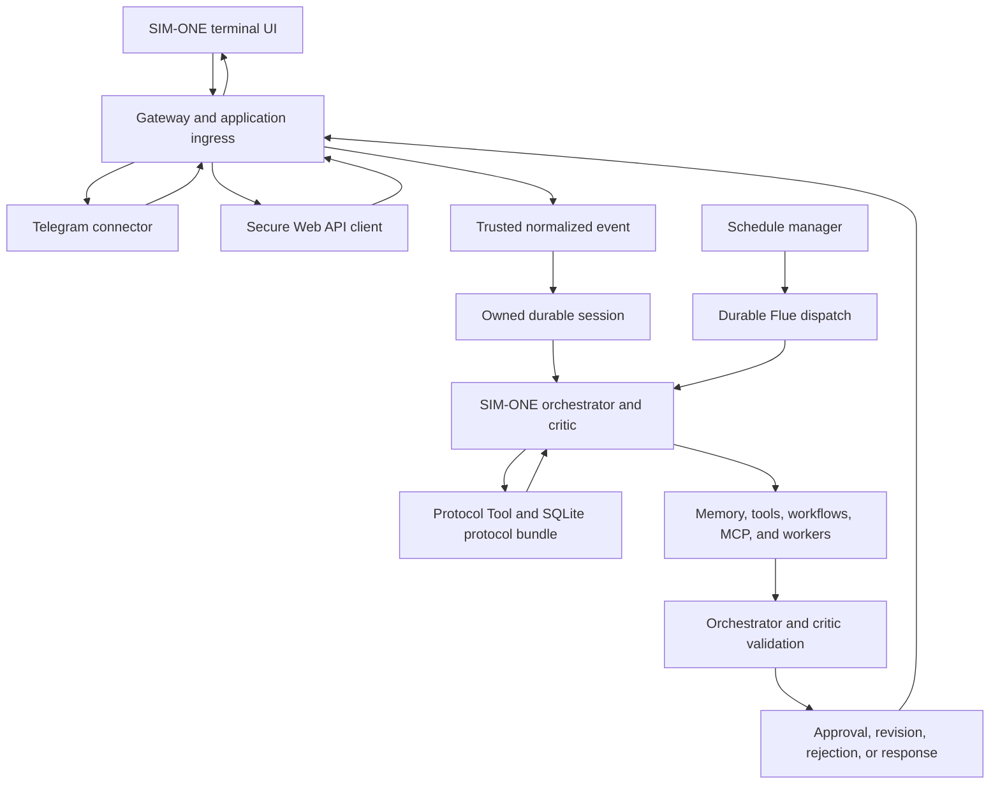

# Product Runtime And Interface Flow

This document describes the SIM-ONE Alpha product surfaces implemented in this
repository and how they enter the governed runtime. Installation and onboarding
instructions live in the [documentation hub](../README.md); this file owns the
runtime and interface architecture.

## Product Identity

- **Company:** Gorombo
- **Product:** SIM-ONE Alpha
- **Product command:** `sim-one`
- **Agent runtime framework:** Flue
- **Governance framework:** SIM-ONE Framework
- **Repository:** `sim-one-alpha`

The terminal client, connectors, API routes, schedules, orchestrator, workers,
and capability registries are parts of one SIM-ONE Alpha product. Workers are
internal executors, not separate products or public endpoints.

## Product Surfaces

| Surface | Current responsibility | Runtime boundary |
| --- | --- | --- |
| SIM-ONE terminal UI | Local conversation, durable sessions, transcript replay, progress, and slash commands | Enters the authenticated loopback chat and session APIs as connector `tui` |
| Telegram | Remote messaging, pairing, allow lists, group policy, replies, and approval delivery | Verifies Telegram input, normalizes the event, and dispatches to the orchestrator |
| Secure Web API | External chat, session, knowledge, schedule, approval, telemetry, and connector administration | Applies application-owned authentication and validation before Flue or product services |
| Schedules | Recurring and one-shot agent turns with durable definitions and run history | Dispatches admitted work to the durable orchestrator agent |
| `sim-one` capability commands | Add, list, enable, disable, update, and remove runtime skills, tools, workers, and MCP servers | Writes the SQLite capability store and managed capability directories |

Presentation and connector code do not contain orchestration logic. Every
conversation or scheduled agent turn reaches the same governing orchestrator.

## Governed Product Flow



The protocol bundle is loaded from trusted event data before final reasoning,
tool execution, worker delegation, or response synthesis. Workers and tools
return results to the orchestrator; they do not approve their own work or send
independent final responses.

## Gateway And Runtime Root

`src/app.ts` is the Hono application shell. It:

- imports model and schedule boot modules;
- registers health, chat, session, knowledge, schedule, telemetry, approval,
  and Telegram administration routes;
- applies API-secret middleware to protected Flue and schedule routes;
- mounts Flue with `app.route('/', flue())`.

The built runtime is emitted under `.gorombo/sim-one-alpha/`. Mutable state is
kept outside the compiled server:

```text
~/.gorombo/
  db/
  capabilities/
  auth/
  logs/
  sim-one-alpha/
  sim-one-cli/
  sim-one-ratatui/
```

The exact root can differ in a source checkout, but the ownership boundary is
the same: packaged application files are replaceable; databases, user
capabilities, credentials, and operational state persist independently.

## Product Command

With no subcommand, `sim-one` launches the packaged terminal client:

```sh
sim-one
```

Current terminal options are:

```text
--port <number>
--base-url <url>
--session <id-or-name>
```

The same command manages runtime capabilities without opening the terminal UI:

```sh
sim-one skill add <source> <id> "<name>" \
  [--description "<text>"] [--version <version-or-git-ref>] [--enable]
sim-one tool add <source> <id> "<name>" \
  [--description "<text>"] [--version <version-or-git-ref>] [--enable]
sim-one worker add <source> <id> "<name>" \
  [--description "<text>"] [--version <version-or-git-ref>] [--enable]
sim-one mcp add <id> "<name>" --url <url> \
  [--transport <streamable-http|sse>] [--token-env <ENV_NAME>] \
  [--description "<text>"] [--enable]
```

Each capability kind also supports `list`, `enable`, `disable`, `update`, and
`remove`. Enabled records are loaded when the orchestrator initializes, so a
gateway process restart is required after lifecycle changes. The current CLI
does not register installer, configuration, diagnostic, or gateway-service
subcommands.

## Capability Activation

```text
User or agent requests capability
-> validate id, source, URL, and built-in/runtime collisions
-> write SQLite capability record
-> materialize file-backed capability when applicable
-> apply default enablement and approval rules
-> restart gateway process
-> load enabled records during orchestrator initialization
-> attach tools, skills, MCP tools, and worker profiles to Flue
```

Skills added by an agent are instruction content and are enabled by default.
Executable tools, workers, and MCP servers added by an agent remain disabled
until user enablement. Enablement does not bypass protocols, trusted scope,
owning-agent attachment, sandbox policy, or action-specific approval.

## Session And Response Ownership

- A normal TUI launch creates a fresh durable session unless an owned session
  is explicitly resumed.
- Telegram retains connector-conversation active-session persistence.
- Generic Web API and scheduled inputs do not inherit Telegram session policy.
- Flue stores canonical session, submission, run, and event-stream state.
- SIM-ONE stores product session metadata, protocols, memory, schedules,
  capabilities, approvals, and connector policy in application-owned stores.
- Only the root orchestrator response becomes the product response. Nested
  worker output remains internal until the orchestrator validates and
  synthesizes it.

## Trust Boundaries

1. Connector and API authentication admit input before model execution.
2. Trusted connector, actor, and conversation identity is persisted outside
   model-selected arguments.
3. Protocol lookup derives selectors from that persisted event.
4. The orchestrator chooses tools, workflows, and workers under the active
   protocol bundle.
5. Workers return structured evidence and cannot approve their own result.
6. Mutating operations use the applicable approval path.
7. Credentials, protocol records, and approval state remain outside the model
   context.

## Related Documentation

- [Architecture Overview](overview.md)
- [Orchestrator Flow](orchestrator-flow.md)
- [Capability System](capability-system.md)
- [TUI, CLI, And Session Flow](tui-cli-session-flow.md)
- [CLI Reference](../reference/cli.md)
- [HTTP API Reference](../reference/http-api.md)
